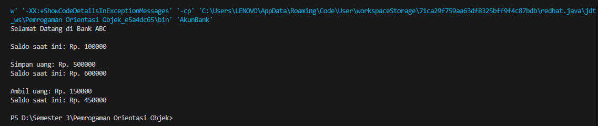

# POO -3

## Latihan 2


### kode main
```java
public class Main {
    public static void main(String[] args) {
        // Membuat objek Person
        Person anton = new Person("Anton", "Laki-laki", 25);
        Person riko = new Person("Riko", "Laki-laki", 30);

        // Menampilkan informasi Person
        System.out.println("Informasi Anton:");
        anton.tampilkanInformasi();

        System.out.println("\nInformasi Riko:");
        riko.tampilkanInformasi();
    }
}
```
###  kode Person
``` java

public class Person {
    // Atribut
    private String nama;
    private String jenisKelamin;
    private int umur;

    // Konstruktor
    public Person(String nama, String jenisKelamin, int umur) {
        this.nama = nama;
        this.jenisKelamin = jenisKelamin;
        this.umur = umur;
    }

    // Getter dan Setter
    public String getNama() {
        return nama;
    }

    public void setNama(String nama) {
        this.nama = nama;
    }

    public String getJenisKelamin() {
        return jenisKelamin;
    }

    public void setJenisKelamin(String jenisKelamin) {
        this.jenisKelamin = jenisKelamin;
    }

    public int getUmur() {
        return umur;
    }

    public void setUmur(int umur) {
        this.umur = umur;
    }

    // Method untuk menampilkan informasi Person
    public void tampilkanInformasi() {
        System.out.println("Nama: " + nama);
        System.out.println("Jenis Kelamin: " + jenisKelamin);
        System.out.println("Umur: " + umur);
    }
}
```

## Latihan 3


### kode akun bank
```java
package latihan3;

public class AkunBank {
        private int saldo;
    
        public AkunBank(int saldo) {
            this.saldo = saldo;
        }
    
        public void simpanUang(int jumlah) {
            saldo += jumlah;
            System.out.println("Simpan uang: Rp. " + jumlah);
            System.out.println("Saldo saat ini: Rp. " + saldo);
            System.out.println(); 
        }
    
        public void ambilUang(int jumlah) {
            if (jumlah > saldo) {
                System.out.println("Saldo tidak cukup");
            } else {
                saldo -= jumlah;
                System.out.println("Ambil uang: Rp. " + jumlah);
                System.out.println("Saldo saat ini: Rp. " + saldo);
                System.out.println(); 
            }
        }
    
        public void cekSaldo() {
            System.out.println("Saldo saat ini: Rp. " + saldo);
            System.out.println(); 
        }
    
        public static void main(String[] args) {
            AkunBank akun = new AkunBank(100000);
            System.out.println("Selamat Datang di Bank ABC");
            System.out.println(); 
            akun.cekSaldo();
            akun.simpanUang(500000);
            akun.ambilUang(150000);
        }
    }
```
