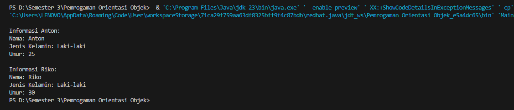

# POO -3

## Latihan 2

### kode main
public class Main {
    public static void main(String[] args) {
        // Membuat objek Person
        Person anton = new Person("Anton", "Laki-laki", 25);
        Person riko = new Person("Riko", "Laki-laki", 30);

        // Menampilkan informasi Person
        System.out.println("Informasi Anton:");
        anton.tampilkanInformasi();

        System.out.println("\nInformasi Riko:");
        riko.tampilkanInformasi();
    }
}
